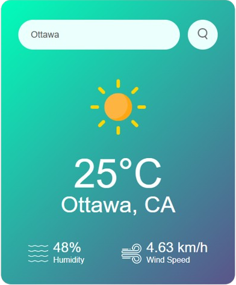
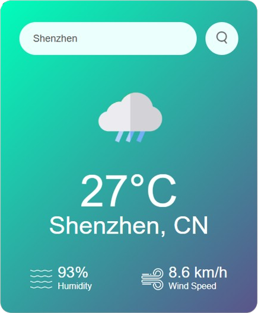

# Weather-App
This website takes a city name as input and returns weather information from the OpenWeatherMap API. The API requires a valid API key in order to process requests, and it can be obtained from their website for free.

### Search Bar
 
Takes a city name as input and displays an error message if an invalid entry is entered

### Invalid Entry

### Successful Requests

